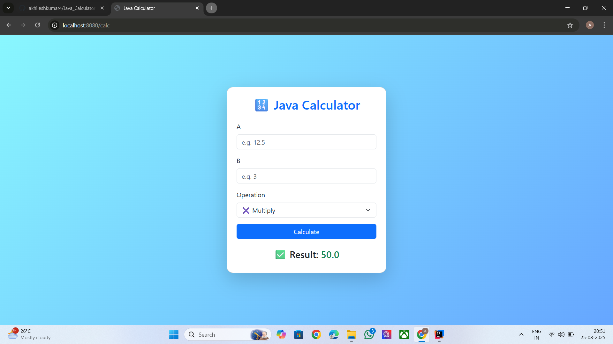

# Java_Calculator

This is a Java-based Calculator Web Application built using the Spring Boot Framework.
In this project, the user enters two numbers and selects an operation (Add, Subtract, Multiply, Divide, Power).
The backend service performs the calculation, and the result is displayed on the UI.

This project is an end-to-end full stack application that includes:

Backend: Java 17, Spring Boot, Spring MVC

Frontend: Thymeleaf (server-side template engine), HTML, CSS, Bootstrap

Build Tool: Maven

Server: Embedded Tomcat (default port 8080)

📂 Project Structure
src/main/java/com/example/calculator
    ├── CalculatorApplication.java       # Main entry point (starts Spring Boot)
    ├── controller/CalculatorController  # Handles requests & responses
    ├── service/CalculatorService        # Calculator logic (add, sub, mul, div, pow)

src/main/resources/
    ├── templates/index.html   # Frontend UI (Thymeleaf template)
    ├── static/style.css       # Custom CSS for UI design

pom.xml                        # Maven configuration (dependencies)

⚙️ Features

➕ Addition

➖ Subtraction

✖ Multiplication

➗ Division

^ Power

Responsive UI (Bootstrap + custom CSS)

Gradient background + modern card layout

Server-side rendering with Thymeleaf

🚀 Technologies Used

Java 17+ – Programming language

Spring Boot 3 – Framework

Maven – Build & dependency management

Thymeleaf – Template engine

Bootstrap 5 – Frontend styling

Embedded Tomcat – Application server

▶️ How to Run (Console Method)
1. Clone the Repository
git clone https://github.com/<your-username>/<repo-name>.git
cd <repo-name>

2. Build the Project
mvn clean install

3. Run the Application
mvn spring-boot:run

Or:

java -jar target/calculator-0.0.1-SNAPSHOT.jar

4. Open in Browser

Go to:

http://localhost:8080/

📖 How It Works (Flow)

The user enters numbers and selects an operation in the browser.

When the form is submitted, the request goes to /calc.

The Controller receives the request and calls the CalculatorService.

The Service executes the operation and returns the result.

The result is then displayed back on the UI through the Thymeleaf template.

✅ Example Usage

Input A = 10, B = 5, Operation = Multiply

Output = 50

Interface(How its look):
## Project Screenshot

🛠️ Stopping the Server

Agar IDE se run kar rahe ho → Console ke upar red stop button dabao.

Agar terminal se run kar rahe ho → jis terminal me app chal rahi hai usme CTRL + C press karo.
